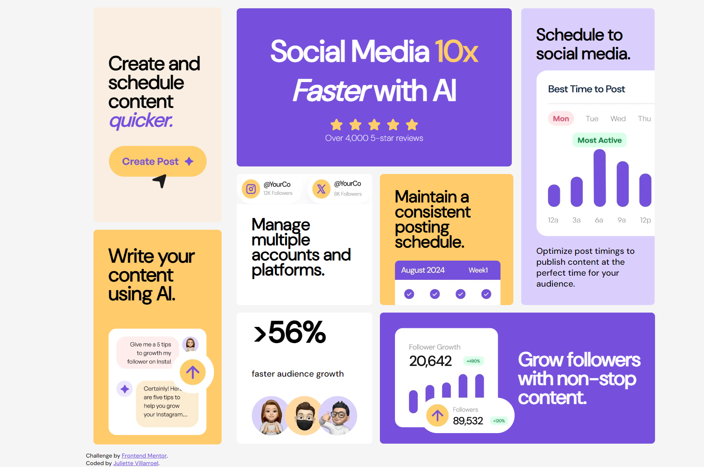

# Frontend Mentor - Bento grid solution

This is a solution to the [Bento grid challenge on Frontend Mentor](https://www.frontendmentor.io/challenges/bento-grid-RMydElrlOj). Frontend Mentor challenges help you improve your coding skills by building realistic projects. 

## Table of contents

- [Overview](#overview)
  - [The challenge](#the-challenge)
  - [Screenshot](#screenshot)
  - [Links](#links)
- [My process](#my-process)
  - [Built with](#built-with)
  - [What I learned](#what-i-learned)
  - [Continued development](#continued-development)
  - [Useful resources](#useful-resources)
- [Author](#author)
- [Acknowledgments](#acknowledgments)

**Note: Delete this note and update the table of contents based on what sections you keep.**

## Overview

### The challenge


Your users should be able to: 

- View the optimal layout for the interface depending on their device's screen size

### Screenshot



### Links

- Solution URL: [GitHub Page](https://github.com/juliettedb-v/bento-grid-main)
- Live Site URL: [GitHub Pages Challenge Solution](https://juliettedb-v.github.io/bento-grid-main/)

## My process

I started by creating my HTML the best way possible, I separated elements with BEM structure to practice. Then I focused on the distribution by checking on the examples. It was a fun and stressful experience, I'd rather working with figma ngl. I put on a good playlist and started to add styles. First I thought I was doing everything great, I decided to make a grid-container and put two more containers inside, the one on the left is flex and the other is grid as well, it seem like I was doing alright. But, If you noticed I decided to use grid-template-areas to organize all my elements of the right container, and I did it perfectly with the desktop view! On the other hand, the mobile view... the cards were not looking as in the picture since I organized them differently. That's when I struggled. I had to re-organize my cards and my HTML to make it fit perfectly in botw views. Anyway It was fun, after taking a good break, I relaxed and actually fixed faster than I thought. I'm very proud of my results!

### Built with

- HTML 
- CSS custom properties
- BEM structure
- CSS Grid


### What I learned

I'm proud of my HTML and BEM distribution. How could I improve it?


```HTML
  <div class="grid-container">

    <!-- I divided grid with 2 containers, left is flex and right is grid -->
    <div class="container-left">

      <div class="card-1">
        <h2 class="card-1_subtitle">Create and schedule content <i class="card-1_subtitle_purple">quicker.</i></h2>
        
      </div>
  
      <div class="card-2">
        <h2 class="card-2_subtitle">Write your content using AI.</h2>
        
      </div>
  
    </div>
  
    <div class="container-right">
      <div class="card-3">
        <h1 class="card-3_title">Social Media <strong class="card-3_title_yellow">10x</strong> <i>Faster</i> with AI</h1>
        
        <p class="card-3_paragraph">Over 4,000 5-star reviews</p>
      </div>
  
      <div class="card-4">
        
        <h3 class="card-4_subtitle">Manage multiple accounts and platforms.</h3>
      </div>

      <div class="card-5">
        <h3 class="card-5_subtitle">Maintain a consistent posting schedule.</h3>
        
      </div>

      <div class="card-6">
        <h3 class="card-6_subtitle">Schedule to social media.</h3>
        <div class="card-6_img">
          
        </div>
        <p class="card-6_paragraph">Optimize post timings to publish content at the perfect time for your audience.</p>
      </div>

      <div class="card-7">
        
        <h2 class="card-7_subtitle">Grow followers with non-stop content.</h2>
      </div>
  
      <div class="card-8">
        <h1 class="card-8_title">>56%</h1>
        <p class="card-8_paragraph">faster audience growth</p>
        
      </div>
    </div>

    <div class="card-a">
      Challenge by <a href="https://www.frontendmentor.io?ref=challenge" target="_blank">Frontend Mentor</a>.
      <br>
      Coded by <a href="https://github.com/juliettedb-v">Juliette Villarroel</a>.
    </div>
  </div>

```
Once again, I'm proud of my basic responsive design, although it seems long...

```css
@media (max-width: 640px) {

    body {
        background-color: whitesmoke;
    }

    .grid-container {
        display: grid;
        grid-template-columns: 1fr;
        width: auto;
        height: auto;
        justify-content: center;
        align-items: center;
    }

    .container-right {
        order: 1;
        display: flex;
        flex-direction: column;
        justify-content: center;
        justify-items: center;
        align-items: center;
        margin: 1rem 1rem 0 1rem;
    }

    .card-3 {
        width: 21.3rem;
        height: 18.3rem;
    }
    
    .card-3_title {
        font-size: 48px;
        margin: 1rem 2rem 1rem 2rem;
    }
    
    .card-3_img {
        width: 12rem;
        margin: 0;
    }
    
    .card-3_paragraph{
        font-size: 18px;
    }

    .card-4 {
        width: 21.3rem;
        height: 10.4rem;
        overflow: hidden;
    }
    
    .card-4_img {
        width: 22rem;
        height: 5rem;
    }
    
    .card-4_subtitle {
        font-size: 24px;
        margin: 0 1rem 2rem;
    }

    .card-5 {
        width: 21.3rem;
        height: 13.6rem;
    }
    
    .card-5_subtitle {
        font-size: 24px;
        margin: 1rem 1rem;
    }
    
    .card-5_img {
        width: 14rem;
        height: auto;
        margin: 0 1rem;
    }

    .card-6 {
        width: 21.3rem;
        height: 29.25rem;
        margin:0;
        text-align: center;
        align-items: center;
    }
    
    .card-6_subtitle {
        font-size: 24px;
        padding: 1rem;
        margin:0;
    }
    
    .card-6_img {
        width: 19.25rem;
        height: 17rem;
        justify-self: center;
    }

    .card-6_img img {
        padding: 0;
        margin: 0;
        width: 19.25rem;
        height: 17rem;
    }

    .card-6_paragraph {
        padding-top: 1rem;
        text-align: center;
    }

    .card-7 {
        display: flex;
        flex-direction: column;
        justify-content: center;
        width: 21.3rem;
        height: 23.3rem;
    }

    .card-7_img {
        padding: 0 3rem 0 3rem;
        justify-self: center;
        width: 14.6rem;
        height: 12rem;
    }
    
    
    .card-7_subtitle {
        font-size: 32px;
        text-align: center;
        margin: 1rem 3rem 0 3rem;
    }

    .card-8 {
        display: flex;
        flex-direction: column;
        justify-content: flex-start;
        width: 21.3rem;
        height: 13.2rem; 
    }

    .card-8_title {
        padding: 0.5rem 1rem 0 1rem;
        font-size: 42px;
    }

    .card-8_paragraph {
        padding-left: 1rem;
        font-size: 18px;
    }
    
    .card-8_img {
        padding: 0 1rem;
        width: 12.5rem;
        height: 4.5rem;
    }

    .container-left {
        order: 2;
        align-items: center;
    }

    .card-1 {
        width: 21.3rem;
        height: 15rem;
    }

    .card-1_subtitle {
        font-size: 28px;
    }

    .card-1_img {
        width: 12rem;
        padding: 0 2rem 2rem 2rem;
    }

    .card-2 {
        width: 21.3rem;
        height: 21.8rem;
    }
    
    .card-2_subtitle {
        font-size: 28px;
    }
    
    .card-2_img {
        width: 12rem;
        padding: 0 2rem 2rem 2rem;
    }

    
    .card-a {
        display: none;
    }

}

```

### Continued development

This challenge made me realize how interesting mobile-first responsive design is! So I'd like to learn more about it in the near future. I'll keep improving my CSS-grid performance, so you'll see more!

### Useful resources

- [Px to rem conversor](https://nekocalc.com/es/px-a-rem-conversor) - This helped me to converse all my px values to rem, it was faster.
- [Iconic cssreference.io](https://cssreference.io) - This helped me a lot to check on properties.

## Author

- Website - [Juliette](https://github.com/juliettedb-v/bento-grid-main)
- Frontend Mentor - [@juliettedb-v](https://www.frontendmentor.io/profile/juliettedb-v)

## Acknowledgments

Taking Platzi's courses really helped me out to understand basic knowledge that I needed for completing this challenge. I know it's helpful for a lot of hispanics out there and I highly recommend it.
